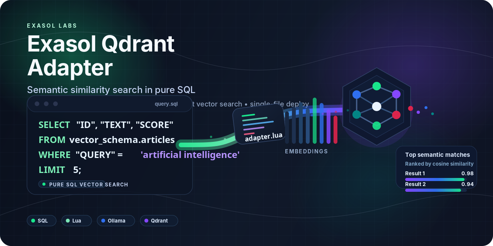

<p align="center">
  
</p>

# Exasol Qdrant Vector Search Adapter

A Virtual Schema adapter that brings semantic similarity search into Exasol SQL using [Qdrant](https://qdrant.tech/) as the vector store and [Ollama](https://ollama.com/) for local text embeddings.

```sql
-- Find the most semantically similar documents — pure SQL
SELECT "ID", "TEXT", "SCORE"
FROM vector_schema.articles
WHERE "QUERY" = 'artificial intelligence'
LIMIT 5;
```

## How It Works

```
Exasol SQL query
      ↓
Virtual Schema Adapter (Lua, runs inside Exasol — no BucketFS, no JAR)
      ↓
Ollama (local embeddings — text → float vector)
      ↓
Qdrant (vector similarity search)
      ↓
Ranked results back to Exasol
```

- No pre-computed embeddings needed — the adapter calls Ollama automatically at query time
- Results are ranked by cosine similarity score (0–1, higher = more similar)
- Works with any Ollama embedding model (default: `nomic-embed-text`)
- Deployed as a single SQL statement — no Maven build, no BucketFS upload

---

## Prerequisites

| Component | Version | Notes                               |
| --------- | ------- | ----------------------------------- |
| Exasol    | 7.x+    | Docker or on-premise                |
| Qdrant    | 1.9+    | Docker recommended                  |
| Ollama    | latest  | Must have `nomic-embed-text` pulled |

**Dev-only** (only needed to rebuild `dist/adapter.lua` after source changes):

| Tool       | Install                       |
| ---------- | ----------------------------- |
| Lua 5.4    | `brew install lua` / apt      |
| lua-amalg  | `luarocks install amalg`      |
| virtual-schema-common-lua | `luarocks install virtual-schema-common-lua` |

---

## Quick Start (Docker)

### 1. Start Exasol

```bash
docker run -d --name exasoldb -p 8563:8563 --privileged exasol/docker-db:latest
```

Exasol takes about 90 seconds to initialize. Wait before connecting.
Default credentials: `host=localhost, port=8563, user=sys, password=exasol`.

### 2. Start Qdrant

```bash
docker run -d --name qdrant -p 6333:6333 qdrant/qdrant
```

### 3. Start Ollama and pull the embedding model

```bash
docker run -d --name ollama -p 11434:11434 ollama/ollama
docker exec ollama ollama pull nomic-embed-text
```

### 4. Install everything in Exasol (one file)

Open [`scripts/install_all.sql`](scripts/install_all.sql) in your SQL client (DBeaver, DbVisualizer, etc.). Update the IPs in the `CONFIGURATION` section if needed, then run the entire file.

> **SQL client setup:** This file uses `/` (forward slash on its own line) as the
> statement separator — not `;`. Configure your SQL client accordingly:
>
> - **DBeaver:** Open the file, then use *SQL Editor → Execute SQL Script* (Alt+X).
>   If it fails, go to *Window → Preferences → SQL Editor* and set the
>   "Script statement delimiter" to `/`.
> - **DbVisualizer:** The `/` delimiter is supported by default when using
>   "Execute as Script."
> - **exaplus (CLI):** Run with `exaplus -f install_all.sql` — it handles `/` natively.

It deploys:

- Schema, connection, Lua adapter script
- Python UDFs for data ingestion (`CREATE_QDRANT_COLLECTION`, `EMBED_AND_PUSH_V2`, `EMBED_AND_PUSH`)
- Virtual schema ready for queries

```bash
# Default config values (change if your setup differs):
#   Qdrant:  http://172.17.0.1:6333
#   Ollama:  http://172.17.0.1:11434
#   Model:   nomic-embed-text
#   Schema:  ADAPTER
```

> **No BucketFS, no JAR, no Maven, no pasting.** One file, one run, everything deployed.

> **Docker networking note:** `host.docker.internal` does not resolve inside Exasol's UDF sandbox on Linux. Use the Docker bridge gateway IP (typically `172.17.0.1`) for **both** the Lua adapter (OLLAMA_URL property) and the Python UDFs (connection config). This is the same IP for Qdrant and Ollama -- use the gateway IP everywhere, not the container IP. Find it with:
>
> ```bash
> docker exec exasoldb ip route show default
> # --> default via 172.17.0.1 dev eth0
> # Use 172.17.0.1 for BOTH qdrant_url and ollama_url
> ```

---

## Step 5: Verify the Installation

> **Always run this example first** before loading your own data. If this works,
> your entire stack (Exasol, Qdrant, Ollama, adapter, UDFs, virtual schema)
> is correctly deployed.

After running `install_all.sql`, try this complete example to see semantic search working in under a minute. It creates a small sample table, ingests it into Qdrant, and queries it.

```sql
-- 1. Create a sample table with 5 documents
CREATE OR REPLACE TABLE ADAPTER.hello_world (
    id DECIMAL(5,0),
    doc VARCHAR(200)
);
INSERT INTO ADAPTER.hello_world VALUES (1, 'The quick brown fox jumps over the lazy dog');
INSERT INTO ADAPTER.hello_world VALUES (2, 'A fast red car drives down the highway at night');
INSERT INTO ADAPTER.hello_world VALUES (3, 'Machine learning models predict stock market trends');
INSERT INTO ADAPTER.hello_world VALUES (4, 'The chef prepared a delicious pasta with fresh tomatoes');
INSERT INTO ADAPTER.hello_world VALUES (5, 'Neural networks are inspired by biological brain structures');

-- 2. Create a Qdrant collection for the sample data
SELECT ADAPTER.CREATE_QDRANT_COLLECTION(
    '172.17.0.1', 6333, '', 'hello_world', 768, 'Cosine', ''
);

-- 3. Embed and push the documents (using V2 with CONNECTION)
SELECT ADAPTER.EMBED_AND_PUSH_V2(
    'embedding_conn',
    'hello_world',
    CAST(ID AS VARCHAR(36)),
    DOC
)
FROM ADAPTER.hello_world
GROUP BY IPROC();

-- 4. Refresh the virtual schema to see the new collection
ALTER VIRTUAL SCHEMA vector_schema REFRESH;

-- 5. Search! Find documents about AI / machine learning
-- (Each query takes ~5-8 seconds — this is normal, see Performance Note below)
SELECT "ID", "TEXT", "SCORE"
FROM vector_schema.hello_world
WHERE "QUERY" = 'artificial intelligence'
LIMIT 5;
-- Expected: "Neural networks..." and "Machine learning..." rank highest

-- 6. Try another search
SELECT "ID", "TEXT", "SCORE"
FROM vector_schema.hello_world
WHERE "QUERY" = 'animals running fast'
LIMIT 5;
-- Expected: "The quick brown fox..." ranks highest
```

> **Timing:** Embedding 5 documents takes about 5–10 seconds. For larger datasets
> (e.g., 544 rows), expect 30–60 seconds. The query will appear to "hang" until
> all embeddings are computed and uploaded — this is normal.

> **Tip:** To ingest your own Exasol table, replace the placeholders below:
>
> ```sql
> -- 1. Create a collection for your data
> SELECT ADAPTER.CREATE_QDRANT_COLLECTION(
>     '172.17.0.1', 6333, '', 'my_collection', 768, 'Cosine', ''
> );
>
> -- 2. Embed and push rows from your table
> SELECT ADAPTER.EMBED_AND_PUSH_V2(
>     'embedding_conn',
>     'my_collection',
>     CAST(id_column AS VARCHAR(36)),
>     text_column
> )
> FROM MY_SCHEMA.MY_TABLE
> GROUP BY IPROC();
>
> -- 3. Refresh and query
> ALTER VIRTUAL SCHEMA vector_schema REFRESH;
> SELECT "ID", "TEXT", "SCORE"
> FROM vector_schema.my_collection
> WHERE "QUERY" = 'your search query'
> LIMIT 5;
> ```

---

## Loading Data

There are two ways to get data into Qdrant so you can query it via the virtual schema:

### Option A — Ingestion via Exasol UDFs (recommended for Exasol-native data)

If your source data already lives in Exasol tables, use a UDF to embed rows with Ollama and push them to Qdrant without leaving SQL. **No SLC or extra packages required** — the UDFs use Python's standard library only.

#### `EMBED_AND_PUSH_V2` (recommended — CONNECTION-based)

Simplified 4-parameter UDF that reads infrastructure config from a CONNECTION object. Credentials never appear in SQL text or audit logs.

```sql
-- 1. Create a CONNECTION with config as JSON in the address field
CREATE OR REPLACE CONNECTION embedding_conn TO '{
    "qdrant_url": "http://172.17.0.1:6333",
    "ollama_url": "http://172.17.0.1:11434",
    "provider": "ollama",
    "model": "nomic-embed-text"
}';

-- 2. Create the Qdrant collection
SELECT ADAPTER.CREATE_QDRANT_COLLECTION(
    '172.17.0.1', 6333, '', 'my_collection', 768, 'Cosine', ''
);

-- 3. Embed and push — just 4 parameters
SELECT ADAPTER.EMBED_AND_PUSH_V2(
    'embedding_conn',                   -- connection name
    'my_collection',                    -- Qdrant collection
    CAST(id_col AS VARCHAR(255)),       -- unique ID
    text_col                            -- text to embed
)
FROM MY_SCHEMA.MY_TABLE
GROUP BY IPROC();  -- REQUIRED for SET UDFs

-- 4. Search
ALTER VIRTUAL SCHEMA vector_schema REFRESH;
SELECT "ID", "TEXT", "SCORE"
FROM vector_schema.my_collection
WHERE "QUERY" = 'your search query here'
LIMIT 10;
```

#### `EMBED_AND_PUSH` (legacy — 9 positional parameters)

> **Security Warning:** This UDF passes API keys as plain-text SQL parameters. These values appear **verbatim** in Exasol's audit log (`EXA_DBA_AUDIT_SQL`). Anyone with SELECT access to audit tables can harvest your credentials. **Always prefer `EMBED_AND_PUSH_V2` above**, which stores credentials in a CONNECTION object (redacted as `<SECRET>` in audit logs).

The original UDF is still available for backward compatibility:

```sql
SELECT ADAPTER.EMBED_AND_PUSH(
    CAST(id_col AS VARCHAR(36)),
    text_col,                       -- or a concatenation of columns
    '172.17.0.1', 6333, '',        -- Qdrant host, port, API key
    'my_collection',                -- Qdrant collection name
    'ollama',                       -- embedding provider
    'http://172.17.0.4:11434',      -- Ollama container IP (not localhost)
    'nomic-embed-text'              -- Ollama model name
)
FROM MY_SCHEMA.MY_TABLE
GROUP BY IPROC();
```

> **Docker networking:** the UDFs run inside the Exasol container. Use the Ollama
> container IP (find it with `docker inspect ollama`) — not `localhost` or `172.17.0.1`.

See [docs/udf-ingestion.md](docs/udf-ingestion.md) for the full guide including
parameter reference, troubleshooting, and OpenAI provider usage.

### Option B — Direct HTTP ingestion (no Exasol UDFs)

Since Exasol virtual schemas are read-only, data can also be inserted directly into Qdrant via its REST API. The adapter handles query-time embedding automatically via Ollama.

**curl (Linux/macOS/WSL):**

```bash
# Create collection (768 dimensions for nomic-embed-text)
curl -X PUT 'http://localhost:6333/collections/articles' \
  -H 'Content-Type: application/json' \
  -d '{"vectors":{"text":{"size":768,"distance":"Cosine"}}}'

# Get embedding from Ollama
EMBEDDING=$(curl -s http://localhost:11434/api/embeddings \
  -d '{"model":"nomic-embed-text","prompt":"Machine learning is a subset of AI"}' \
  | python3 -c "import sys,json; print(json.dumps(json.load(sys.stdin)['embedding']))")

# Upsert into Qdrant
curl -X PUT "http://localhost:6333/collections/articles/points" \
  -H 'Content-Type: application/json' \
  -d "{\"points\":[{\"id\":\"$(uuidgen)\",\"payload\":{\"_original_id\":\"doc-1\",\"text\":\"Machine learning is a subset of AI\"},\"vectors\":{\"text\":$EMBEDDING}}]}"

# Refresh virtual schema to see the new collection
# Run in Exasol: ALTER VIRTUAL SCHEMA vector_schema REFRESH;
```

**PowerShell (Windows):**

```powershell
function Add-Document($collection, $id, $text) {
    # Get embedding from Ollama
    $body = @{ model = "nomic-embed-text"; prompt = $text } | ConvertTo-Json
    $resp = Invoke-RestMethod -Method POST -Uri 'http://localhost:11434/api/embeddings' `
        -ContentType 'application/json' -Body $body

    # Upsert into Qdrant
    $point = @{
        points = @(@{
            id      = [guid]::NewGuid().ToString()
            payload = @{ _original_id = $id; text = $text }
            vectors = @{ text = $resp.embedding }
        })
    } | ConvertTo-Json -Depth 10

    Invoke-RestMethod -Method PUT `
        -Uri "http://localhost:6333/collections/$collection/points" `
        -ContentType 'application/json' -Body $point
}

# Create collection (768 dimensions for nomic-embed-text)
Invoke-RestMethod -Method PUT -Uri 'http://localhost:6333/collections/articles' `
  -ContentType 'application/json' `
  -Body '{"vectors":{"text":{"size":768,"distance":"Cosine"}}}'

# Insert documents
Add-Document "articles" "doc-1" "Machine learning is a subset of artificial intelligence"
Add-Document "articles" "doc-2" "The Eiffel Tower is located in Paris, France"
Add-Document "articles" "doc-3" "Neural networks are inspired by the human brain"

# Refresh virtual schema to see the new collection as a table
# Run in Exasol: ALTER VIRTUAL SCHEMA vector_schema REFRESH;
```

---

## Refresh Virtual Schema

```sql
ALTER VIRTUAL SCHEMA vector_schema REFRESH;
```

## Pre-Flight Health Check

Before creating the virtual schema or ingesting data, verify that Qdrant and Ollama are reachable from inside Exasol:

```sql
SELECT ADAPTER.PREFLIGHT_CHECK(
    'http://172.17.0.1:6333',    -- Qdrant URL
    'http://172.17.0.1:11434',   -- Ollama URL
    'nomic-embed-text'           -- Model name
);
```

Returns a structured report:
```
=== PREFLIGHT CHECK: ALL CHECKS PASSED ===
[PASS] Qdrant: reachable, 2 collection(s): articles, products
[PASS] Ollama: reachable, models: nomic-embed-text:latest
[PASS] Model 'nomic-embed-text': available
[PASS] Embedding test: 768-dimensional vector returned
```

If any check fails, the report includes troubleshooting steps (Docker bridge IP, model pull commands).

---

## Querying

After refreshing the virtual schema, each Qdrant collection appears as a table.

```sql
-- Semantic similarity search
SELECT "ID", "TEXT", "SCORE"
FROM vector_schema.articles
WHERE "QUERY" = 'artificial intelligence'
LIMIT 5;

-- Join with other Exasol tables
SELECT s."ID", s."SCORE", m.author
FROM (
    SELECT "ID", "SCORE"
    FROM vector_schema.articles
    WHERE "QUERY" = 'machine learning'
    LIMIT 10
) s
JOIN my_schema.metadata m ON s."ID" = m.doc_id
ORDER BY s."SCORE" DESC;
```

**Table columns:**

| Column  | Type    | Description                                    |
| ------- | ------- | ---------------------------------------------- |
| `ID`    | VARCHAR | Original document ID as inserted               |
| `TEXT`  | VARCHAR | Original document text                         |
| `SCORE` | DOUBLE  | Cosine similarity (0–1, higher = more similar) |
| `QUERY` | VARCHAR | The query string echoed back                   |

> **Accessing additional metadata:** The virtual schema returns a fixed 4-column schema. To access additional fields from your source data, JOIN the search results with your original table using the ID column:
>
> ```sql
> SELECT s."TEXT", s."SCORE", m.category, m.author
> FROM vector_schema.my_collection s
> JOIN MY_SCHEMA.MY_TABLE m ON s."ID" = CAST(m.id_column AS VARCHAR(36))
> WHERE s."QUERY" = 'your search query'
> LIMIT 5;
> ```

> Always quote column names with double quotes (`"QUERY"`) to avoid conflicts with Exasol reserved keywords.
>
> **Default limit:** When no `LIMIT` clause is specified, results are capped at **10 rows**. Always include an explicit `LIMIT` to control how many results you get back.

> **Empty query handling:** Running `SELECT * FROM vector_schema.collection` without a `WHERE "QUERY" = '...'` clause returns a single hint row with usage instructions instead of crashing. Always include a WHERE clause for actual searches.

> **SCORE filtering:** You can filter by relevance score using standard SQL. Exasol applies SCORE filters after the vector search:
>
> ```sql
> SELECT "ID", "TEXT", "SCORE" FROM vector_schema.my_collection
> WHERE "QUERY" = 'your search query' AND "SCORE" > 0.6 LIMIT 5;
> ```

### Performance Note

Each query takes approximately **5-8 seconds**. This latency is dominated by Exasol's Lua sandbox initialization (~80% of total time), not by the embedding or vector search (~150ms combined). This is a known characteristic of Exasol's UDF sandbox architecture.

For use cases requiring sub-second latency, consider querying Ollama and Qdrant directly via their HTTP APIs (see [Option B: Direct HTTP Ingestion](#option-b-direct-http-ingestion--no-exasol-udfs)).

### Ingestion Tuning

`EMBED_AND_PUSH_V2` reads optional tuning parameters from the CONNECTION config JSON:

| Key | Default | Description |
|-----|---------|-------------|
| `batch_size` | `100` | Number of texts to embed per API call. Lower for large texts, higher for throughput. |
| `max_chars` | `6000` | Max characters per text before truncation (~1500 tokens for nomic-embed-text). |

Example CONNECTION with tuning:

```sql
CREATE OR REPLACE CONNECTION embedding_conn
    TO '{"qdrant_url":"http://172.17.0.1:6333","ollama_url":"http://172.17.0.1:11434","provider":"ollama","model":"nomic-embed-text","batch_size":50,"max_chars":4000}'
    USER '' IDENTIFIED BY '';
```

---

## Virtual Schema Properties

| Property            | Required | Default                  | Description                                                        |
| ------------------- | -------- | ------------------------ | ------------------------------------------------------------------ |
| `CONNECTION_NAME`   | Yes      | —                        | Exasol CONNECTION object with Qdrant URL                           |
| `QDRANT_MODEL`      | Yes      | —                        | Ollama model name for embeddings                                   |
| `OLLAMA_URL`        | Yes      | —                        | Ollama base URL reachable from Exasol (e.g. `http://172.17.0.1:11434` for Docker) |
| `QDRANT_URL`        | No       | —                        | Override Qdrant URL (ignores CONNECTION address)                   |
| `COLLECTION_FILTER` | No       | — (all collections)      | Comma-separated list of collection names or glob patterns to expose |

Change properties without dropping the schema:

```sql
ALTER VIRTUAL SCHEMA vector_schema SET OLLAMA_URL = 'http://172.17.0.4:11434';
ALTER VIRTUAL SCHEMA vector_schema REFRESH;
```

### Collection Filtering

By default, the virtual schema exposes ALL Qdrant collections as tables. Use `COLLECTION_FILTER` to scope which collections are visible:

```sql
-- Only expose specific collections
CREATE VIRTUAL SCHEMA vector_schema
    USING ADAPTER.VECTOR_SCHEMA_ADAPTER
    WITH CONNECTION_NAME   = 'qdrant_conn'
         QDRANT_MODEL      = 'nomic-embed-text'
         OLLAMA_URL        = 'http://172.17.0.1:11434'
         COLLECTION_FILTER = 'bank_*,products';

-- Update the filter later
ALTER VIRTUAL SCHEMA vector_schema SET COLLECTION_FILTER = 'prod_*';
ALTER VIRTUAL SCHEMA vector_schema REFRESH;
```

Supports glob patterns: `*` matches any characters, `?` matches a single character.

---

## Project Structure

```
src/lua/
├── entry.lua                    # Global adapter_call() entrypoint — no business logic
├── adapter/
│   ├── QdrantAdapter.lua        # Adapter lifecycle (create, refresh, setProperties, pushDown)
│   ├── AdapterProperties.lua    # Property constants, validation, merge semantics
│   ├── capabilities.lua         # Capability set declaration
│   ├── MetadataReader.lua       # HTTP GET /collections → table metadata
│   └── QueryRewriter.lua        # Ollama embed + Qdrant search + VALUES SQL builder
└── util/
    └── http.lua                 # LuaSocket JSON GET/POST wrapper
dist/
└── adapter.lua                  # Single-file bundle (output of lua-amalg)
build/
└── amalg.lua                    # Build script: lua build/amalg.lua → regenerates dist/
scripts/
├── install_all.sql              # One-file installer (deploy entire stack)
├── install_adapter.sql          # Standalone Lua adapter script only
├── create_udfs_ollama.sql       # Python UDFs only
└── test_connectivity.sql        # Pre-flight connectivity checks
exasol_udfs/                     # Python UDF source (EMBED_AND_PUSH, EMBED_AND_PUSH_V2, CREATE_QDRANT_COLLECTION, PREFLIGHT_CHECK)
docs/
├── lua-port/
│   └── limitations.md           # Known Lua adapter limitations (TLS caveat etc.)
└── ...
```

---

## Building

The adapter ships as `dist/adapter.lua` — a single file bundled by `lua-amalg`.
You only need to rebuild when modifying `src/lua/` source files.

```bash
# Install dev dependencies (once)
luarocks install amalg
luarocks install virtual-schema-common-lua

# Rebuild dist/adapter.lua
lua build/amalg.lua
```

---

## Known Limitations

- **Semantic search only** -- no BM25 / keyword search. The adapter uses vector similarity exclusively. For hybrid search (semantic + keyword), query Qdrant directly or use a separate full-text search solution.
- **Fixed 4-column schema** -- each virtual table exposes ID, TEXT, SCORE, QUERY. Custom Qdrant payload fields are not directly accessible (use JOINs as a workaround, see above).
- **5-8 second query latency** -- dominated by Exasol's Lua sandbox initialization, not the search itself.
- **Single vector field** -- the adapter searches the `text` vector field. Multi-vector collections are not supported.

---

## Troubleshooting

### "Virtual schema already exists" after DROP

Exasol has a known session-level metadata caching bug where `DROP VIRTUAL SCHEMA` reports success but the schema persists as a "ghost." The next `CREATE VIRTUAL SCHEMA` then fails with "already exists," even though `SELECT * FROM SYS.EXA_ALL_VIRTUAL_SCHEMAS` shows nothing.

**Fix (try in order):**

1. Use `DROP FORCE ... CASCADE` on the virtual schema:
   ```sql
   DROP FORCE VIRTUAL SCHEMA IF EXISTS vector_schema CASCADE;
   ```
   This is safe — `CASCADE` on a **virtual** schema only drops the virtual table mappings, not the underlying ADAPTER schema or its scripts/connections.
2. If it still persists, **disconnect and reconnect** your SQL session, then re-run the DROP + CREATE.
3. As a last resort, use a different schema name (e.g., `vector_schema_2`).

> **Note:** Never use `CASCADE` on the `ADAPTER` schema itself — that would destroy the adapter scripts, UDFs, and connections. `CASCADE` is only safe on the `vector_schema` (virtual schema).

---

## Limitations

See [docs/lua-port/limitations.md](docs/lua-port/limitations.md) for full details. Key points:

- **Read-only virtual schema** — INSERT via the virtual schema is not supported; use the `EMBED_AND_PUSH` UDF (see [docs/udf-ingestion.md](docs/udf-ingestion.md)) or the direct HTTP approach below
- **HTTP or public CA TLS only** — the Lua adapter cannot load custom CA certificates; self-signed TLS on Qdrant/Ollama is not supported
- **One embedding call per query** — Ollama is called synchronously at query time
- **No UPDATE or DELETE** — re-insert with the same ID to overwrite (upsert behaviour)
- **Model consistency** — changing `QDRANT_MODEL` does not re-embed existing data; recreate the collection

---

## License

This project is licensed under the [MIT License](LICENSE).
